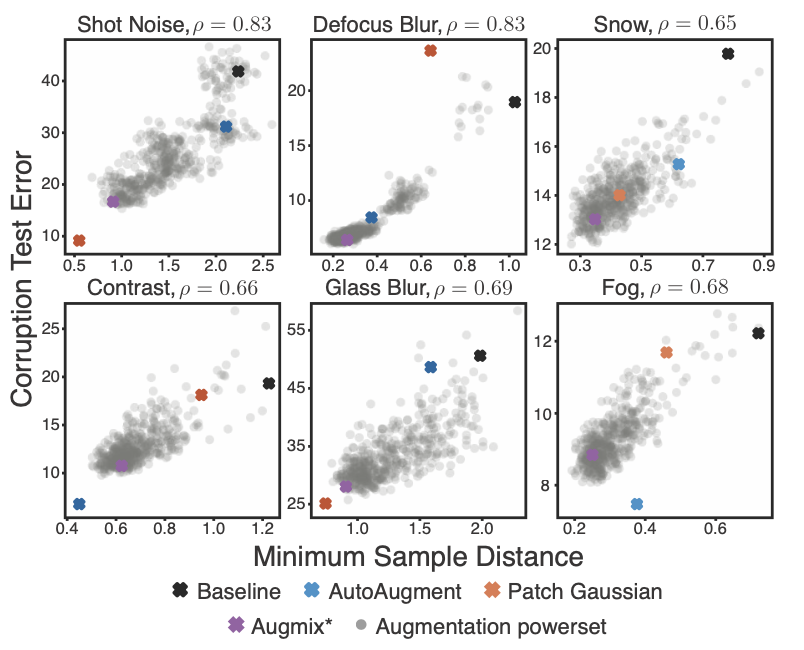
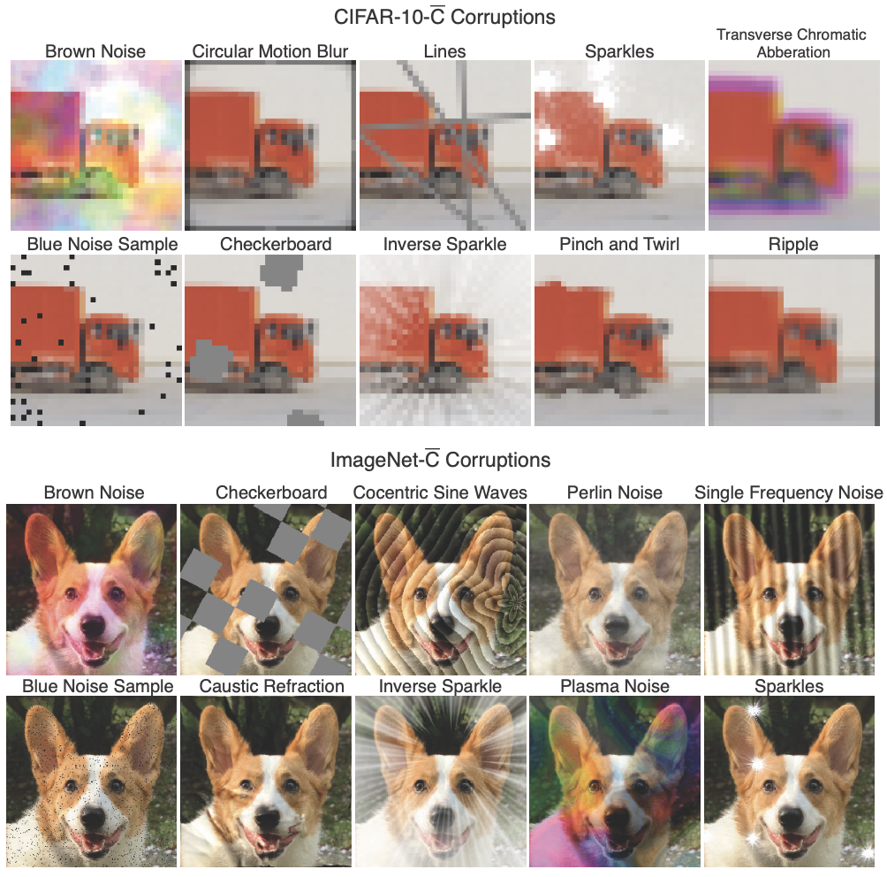
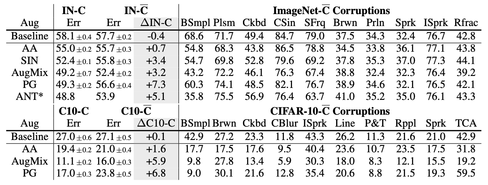

# On Interaction Between Augmentations and Corruptions in Natural Corruption Robustness

This repository provides the code for the paper *On Interaction Between Augmentations and Corruptions in Natural Corruption Robustness*.  This paper studies how perceptual similarity between a set of training augmentations and a set of test corruptions affects test error on those corruptions and shows that common augmentation schemes often generalize poorly to perceptually dissimilar corruptions. 

The repository is divided into three parts.  First, the Jupyter notebook `minimal_sample_distance.ipynb` illustrates how to calculate the measure of distance between augmentations and corruptions proposed in the paper.  Second, `imagenet_c_bar/` provides code to generate or test on the datasets CIFAR-10-C-bar and ImageNet-C-bar, which are algorithmically chosen to be dissimilar from CIFAR-10/ImageNet-C and are used to study generalization.  Finally, `experiments/` provides code to reproduce the experiments in the paper.  Usage of these latter two is described in their respective READMEs.

---

### New: preprocessed ImageNet-C-bar dataset
With the help from collegues at Berkeley, you can download a preprocessed copy of the IN dataset from [here](https://dl.fbaipublicfiles.com/inc_bar/imagenet_c_bar.tar.gz). 

The dataset follows the ImageNet-C folder structure, so you can easily benchmark robustness results on our dataset with minimal modifications to your ImageNet-C dataloader. We have 10 different corruption types 

\["blue_noise_sample", "brownish_noise", "caustic_refraction", 
"checkerboard_cutout", "cocentric_sine_waves", "inverse_sparkles", 
"perlin_noise", "plasma_noise", "single_frequency_greyscale", "sparkles"\] 

and similar to ImageNet-C, 5 different severities, structured as follows:


```
/path/to/imagenet-c-bar/
    blue_noise_sample/
      1/
        n01440764/
            ILSVRC2012_val_00000293.JPEG
            ...
      2/
      3/
      4/
      5/
    brownish_noise/
    caustic_refraction/
    checkerboard_cutout/
    cocentric_sine_waves/
    inverse_sparkles/
    perlin_noise/
    plasma_noise/
    single_frequency_greyscale/
    sparkles
```

---

This paper:

1. Defines the *minimal sample distance*, which provides a measure of similarity on a perceptual feature space f(t) between augmentations and corruptions, extracted using a pre-trained neural network. This measure is assymetric to account for the fact that augmentation distributions are typically broader than any one corruption distribution but can still lead to good error if they produce augmentations that are perceptually similar to the corruption: 
 
<p align="center"></p>
 
2. Shows percetual similarity between train-time augmentations and test-time corruptions is often predictive of corruption error, across several common corruptions and augmentations. A large set of artificial augmentation schemes, called the augmentation powerset, is also introduced to better analyze the correlation:

<p align="center"></p>
 
3. Introduces a new set of corruptions designed to be perceptually dissimilar from the common benchmark [CIFAR10/ImageNet-C](https://arxiv.org/abs/1903.12261). These new corruptions are chosen algorithmically from a set of 30 natural, human interpretable corruptions using the perceptual feature space defined above.

<p align="center"></p>

4. Shows that several common data augmentation schemes that improve corruption robustness perform worse on the new dataset, suggesting that generalization is often poor to dissimilar corruptions. Here [AutoAugment](https://arxiv.org/abs/1912.02781), [Stylized-ImageNet](https://arxiv.org/abs/1811.12231), [AugMix](https://arxiv.org/abs/1912.02781), [Patch Gaussian](https://arxiv.org/abs/1906.02611), and [ANT<sup>3x3</sup>](https://arxiv.org/abs/2001.06057) are studied.

<p align="center"></p>

\* Base example images copyright Sehee Park and Chenxu Han.

## License
**augmentation-corruption** is released under the MIT license. Please see the [LICENSE](LICENSE) file for more information.

## Contributing

We actively welcome your pull requests! Please see [`CONTRIBUTING.md`](CONTRIBUTING.md) and [`CODE_OF_CONDUCT.md`](CODE_OF_CONDUCT.md) for more info.

## References
[Cubuk, E. D., Zoph, B., Mane ́, D., Vasudevan, V., and Le, Q. V. AutoAugment: Learning augmentation strategies from data. In CVPR, 2019.](https://arxiv.org/abs/1912.02781)

[Geirhos, R., Rubisch, P., Michaelis, C., Bethge, M., Wichmann, F. A., and Brendel, W. ImageNet-trained CNNs are biased towards texture; increasing shape bias improves accuracy and robustness. In ICLR, 2019.](https://arxiv.org/abs/1811.12231)

[Hendrycks, D. and Dietterich, T. Benchmarking neural network robustness to common corruptions and perturbations. In ICLR, 2018.](https://arxiv.org/abs/1903.12261)

[Hendrycks, D., Mu, N., Cubuk, E. D., Zoph, B., Gilmer, J., and Lakshminarayanan, B. AugMix: A simple data processing method to improve robustness and uncertainty. In ICLR, 2019.](https://arxiv.org/abs/1912.02781)

[Lopes, R. G., Yin, D., Poole, B., Gilmer, J., and Cubuk, E. D. Improving robustness without sacrificing accuracy with Patch Gaussian augmentation. arXiv preprint arXiv:1906.02611, 2019.](https://arxiv.org/abs/1906.02611)

[Rusak, E., Schott, L., Zimmermann, R., Bitterwolf, J., Bringmann, O., Bethge, M., and Brendel, W. A simple way to make neural networks robust against diverse image corruptions. arXiv preprint arXiv:2001.06057, 2020.](https://arxiv.org/abs/2001.06057)

